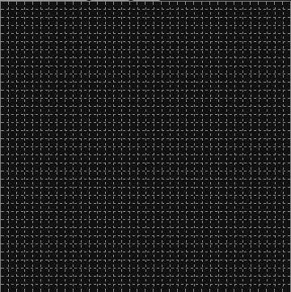

# [Game of Life](https://techa.github.io/game-of-life/)
> Game of Life playground

## Feature
* [Rules](https://conwaylife.com/wiki/Rulestring) can be changed.
* Equipped with [Generations rule](https://conwaylife.com/wiki/Generations).
* UNDEAD and TOMB cell types implemented.
* Terrain generation using cellular automata.
* Create a random initial state.

## ToDo
- [ ] ColorPicker
	- [x] HUE slider
	- [ ] Reload Gradation
- [ ] Tools: Pen, FillPaint
	- [ ] LIVE & DEATH <--> UNDEAD & TOMB
- [ ] InitializerSettings
	- [ ] Save sttings localStrage
- [ ] Save Rule to localStrage

## Terrain generation

## Links
* Rules: https://conwaylife.com/wiki/List_of_Life-like_cellular_automata
* Patterns: https://conwaylife.com/ref/lexicon/lex_home.htm
